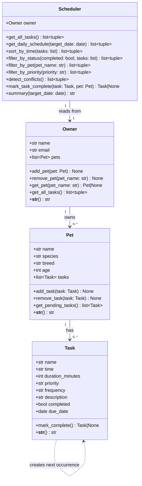

# PawPal+ — Final System Architecture (UML)

Paste the code block below into [Mermaid Live Editor](https://mermaid.live) to render the diagram.

## Relationships

| Relationship | Type | Description |
|---|---|---|
| Owner → Pet | Composition | An Owner holds a list of Pet objects; pets are managed through the Owner |
| Pet → Task | Composition | A Pet holds a list of Task objects; tasks are added and removed via the Pet |
| Scheduler → Owner | Association | Scheduler reads from the Owner to retrieve all pets and tasks |
| Task → Task | Dependency | `mark_complete()` on a recurring Task produces a new Task instance |
